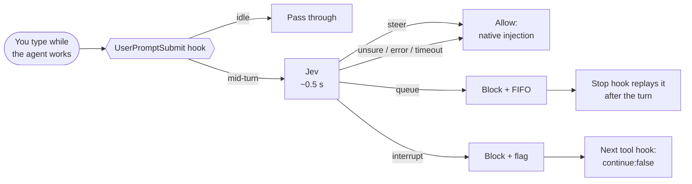

<div align="center">


<br>

**Your coding agent is busy. You send another message. Should it change course, wait its turn, or stop?**<br>
A hook that lets [TypeSafe Jev](https://docs.typesafe.ai/) make that call in about half a second.

<br>

[](LICENSE)
[](claude-code/)
[-10a37f?style=flat-square)](codex/)
[](https://docs.typesafe.ai/)
[](claude-code/scripts/jev_router.py)
[](claude-code/scripts/jev_router.py)
<br>
[](https://github.com/Larkspur-Wang/Jev_steer_or_queue/stargazers)
[](https://github.com/Larkspur-Wang/Jev_steer_or_queue/commits/main)
[](https://github.com/Larkspur-Wang/Jev_steer_or_queue/issues)
[](#contributing)

**English** · [简体中文](README.zh-CN.md)

</div>

---

## Why

Coding agents treat every message you send mid-turn the same way. Claude Code injects it into the running turn right away. That works for *"use the simpler approach"*, but not for *"when you're done, update the changelog"*, which then gets mixed into the current task. Nor does it work for *"stop, don't continue"*, which only works if the model decides to stop.

This project classifies each mid-turn message into one of three timings and acts on it:

| Jev says | Meaning | What the hook does |
| :--- | :--- | :--- |
| 🟢 **steer** | Change the running task now | Lets it through; the client injects it at the next tool boundary |
| 🟡 **queue** | Separate request, do it afterwards | Holds it in a per-session FIFO and replays it when the turn ends |
| 🔴 **interrupt** | Stop the running task | Swallows the message and ends the turn at the next tool boundary |

Messages sent while the agent is idle are never touched and never sent to Jev.

## Clients

| Client | Folder | Status |
| :--- | :--- | :--- |
| Claude Code CLI | [`claude-code/`](claude-code/) | ✅ Tested end to end on 2.1.280 |
| Codex CLI | [`codex/`](codex/) | ✅ Tested on 0.156.1, with a caveat: Codex can only be nudged, not blocked |

The two clients have different hook contracts, so each one has its own self-contained folder.

## How it works



- **Mid-turn detection:** Claude Code gives a mid-turn message the running turn's `prompt_id`, and gives a new turn a fresh one.
- **Only confident answers change behaviour.** Queue and interrupt each need probability ≥ 0.9, and interrupt also needs an explicit "stop" signal. Anything else falls back to the client's native behaviour.
- **Fails open.** A missing key, a network error or a timeout (default 2 s) means the message passes through untouched.

## Quick start (Claude Code)

```text
/plugin marketplace add Larkspur-Wang/Jev_steer_or_queue
/plugin install jev-steer-or-queue@jev-steer-or-queue
```

Claude Code then asks for:

1. **TypeSafe API key.** Get one at [console.typesafe.ai](https://console.typesafe.ai/). It is stored in the system keychain. Leave it empty to use the `TYPESAFE_API_KEY` environment variable.
2. **Mode.** `shadow` (the default) only logs decisions. `active` queues and stops for real. You can change it later in `/config`.

Start in `shadow`, read the log for a few days, then switch to `active`. See [`claude-code/README.md`](claude-code/README.md) for all options.

## Limitations

- **The hook can only stop at tool boundaries.** A running command finishes first, and a turn that is only producing text can't be stopped.
- **Esc fires no hook.** Messages still in the queue when you press Esc are listed and dropped on your next prompt.
- **Held messages don't appear as user messages.** You see the hook's notice, and a replayed message shows up as `Stop hook feedback`.
- **Jev can be wrong,** especially on colloquial Chinese, negations and messages with several intents. Calibrate the thresholds on your own messages.

## Privacy

For every **mid-turn** message, the hook sends TypeSafe the message (up to 2,000 characters) and the start of the current task (up to 500 characters). Nothing else is sent: no transcript, no files, no tool output. Logs stay on your machine; set `JEV_ROUTER_LOG_PROMPTS=false` to keep message text out of them.

## Test results

See [`docs/test-results.md`](docs/test-results.md) for the Chinese-language test notes: what each hook actually receives, how the client behaves with and without the plugin, and latency.

## Contributing

Issues and pull requests are welcome, especially:

- real mid-turn messages that were misclassified (redact them first),
- Codex CLI test results,
- adapters for other clients (Cursor, Grok Build, OpenClaw).

## Acknowledgements

- [TypeSafe](https://typesafe.ai/) for Jev and the System One API.
- The OpenClaw [queue modes](https://docs.openclaw.ai/concepts/queue) (`steer` / `followup` / `interrupt`) and other Jev-based routers ([pi-card](https://github.com/carbon-ni/pi-card), [KiroCrew #12338](https://github.com/kirodotdev/KiroCrew/pull/12338)) for prior art.

## License

[MIT](LICENSE) © 2026 Larkspur-Wang. Not affiliated with TypeSafe, Anthropic or OpenAI.
