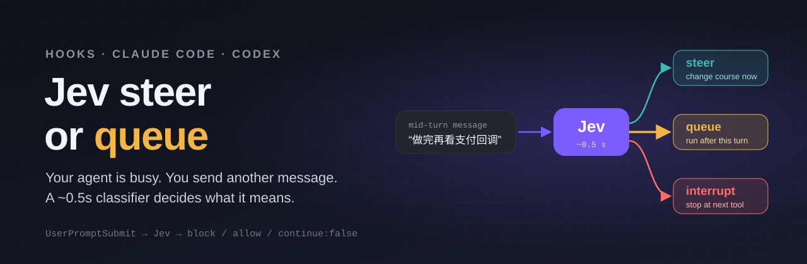
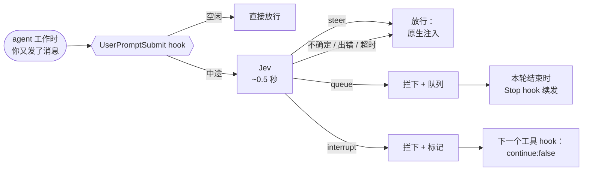

<div align="center">



<br>

**编码 agent 正在干活，你又发了一条消息：它该改做法、排队等着，还是停下？**<br>
用 [TypeSafe Jev](https://docs.typesafe.ai/) 在 hook 里约 0.5 秒自动判断。

<br>

[](LICENSE)
[](claude-code/)
[-10a37f?style=flat-square)](codex/)
[](https://docs.typesafe.ai/)
[](claude-code/scripts/jev_router.py)
[](claude-code/scripts/jev_router.py)
<br>
[](https://github.com/Larkspur-Wang/Jev_steer_or_queue/stargazers)
[](https://github.com/Larkspur-Wang/Jev_steer_or_queue/commits/main)
[](https://github.com/Larkspur-Wang/Jev_steer_or_queue/issues)
[](#参与贡献)

[English](README.md) · **简体中文**

</div>

---

## 为什么需要

编码 agent 对任务运行中收到的消息一视同仁。Claude Code 会立刻把它注入当前 turn。“改用简单点的方案”这样很合适；“做完之后顺便更新 changelog”会被混进当前任务；“停一下，别继续了”要靠模型自己愿意停。

这个项目把每条中途消息分成三类，并按类别处理：

| Jev 判定 | 含义 | hook 做什么 |
| :--- | :--- | :--- |
| 🟢 **steer** | 现在就改当前任务 | 放行，客户端在下一个工具边界注入 |
| 🟡 **queue** | 另一件事，做完再说 | 拦下存进本会话队列，本轮结束时续发 |
| 🔴 **interrupt** | 停下当前任务 | 吞掉这条消息，在下一个工具边界结束本轮 |

空闲时发的消息不会被改动，也不会发给 Jev。

## 支持的客户端

| 客户端 | 目录 | 状态 |
| :--- | :--- | :--- |
| Claude Code CLI | [`claude-code/`](claude-code/) | ✅ 已在 2.1.280 上端到端测试 |
| Codex CLI | [`codex/`](codex/) | ✅ 已在 0.156.1 上测试；但 Codex 只能“软提示”，不能拦截 |

两个客户端的 hook 协议不同，所以各自一个独立目录。

## 工作原理



- **识别中途消息：** Claude Code 给中途消息带上当前 turn 的 `prompt_id`，新 turn 会换一个新的。
- **只有高置信度才改变行为：** queue、interrupt 都要求概率 ≥ 0.9，interrupt 还要“明确要求停止”也成立。其余情况保持客户端原生行为。
- **失败即放行：** 没有 key、网络错误、超时（默认 2 秒）时，消息原样通过。

## 快速开始（Claude Code）

```text
/plugin marketplace add Larkspur-Wang/Jev_steer_or_queue
/plugin install jev-steer-or-queue@jev-steer-or-queue
```

安装时会问：

1. **TypeSafe API key**：在 [console.typesafe.ai](https://console.typesafe.ai/) 获取，存进系统钥匙串。留空则读环境变量 `TYPESAFE_API_KEY`。
2. **Mode**：`shadow`（默认，只记录判定）或 `active`（真的排队和停止），之后可以在 `/config` 里改。

建议先用 `shadow` 跑几天看日志，再切 `active`。全部配置见 [`claude-code/README.md`](claude-code/README.md)。

## 已知限制

- **只能在工具边界停：** 正在跑的命令会先跑完，只输出文字、没有调用工具时停不下来。
- **按 Esc 不触发任何 hook：** 当时还在队列里的消息，会在你下一次发消息时列出来并丢弃。
- **被拦下的消息不会作为用户消息出现：** 只能看到 hook 的提示；续发的消息显示为 `Stop hook feedback`。
- **Jev 会判错：** 尤其是中文口语、否定句和一句话里混了几个意图的情况。请用自己的消息校准阈值。

## 隐私

每条**中途**消息会把消息本身（最多 2000 字）和当前任务的开头（最多 500 字）发给 TypeSafe。不发送对话记录、文件或工具输出。日志只存在本机；设置 `JEV_ROUTER_LOG_PROMPTS=false` 可以不记录消息原文。

## 测试记录

见 [`docs/test-results.md`](docs/test-results.md)：每个 hook 实际收到什么，装与不装插件时客户端的行为，以及延迟。

## 参与贡献

欢迎提 Issue 和 PR，尤其是：

- 被判错的真实中途消息（请先脱敏）
- Codex CLI 的测试结果
- 其他客户端的适配（Cursor、Grok Build、OpenClaw）

## 致谢

- [TypeSafe](https://typesafe.ai/) 提供 Jev 和 System One API。
- OpenClaw 的 [queue 模式](https://docs.openclaw.ai/concepts/queue)（`steer` / `followup` / `interrupt`），以及其他基于 Jev 的实现：[pi-card](https://github.com/carbon-ni/pi-card)、[KiroCrew #12338](https://github.com/kirodotdev/KiroCrew/pull/12338)。

## 许可证

[MIT](LICENSE) © 2026 Larkspur-Wang。本项目与 TypeSafe、Anthropic、OpenAI 无关联。
